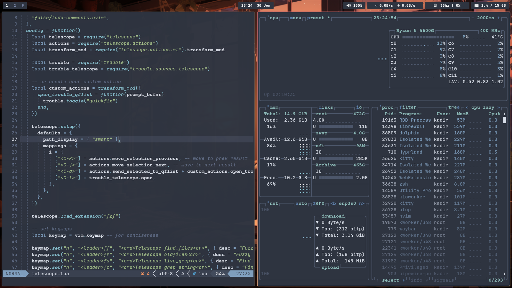
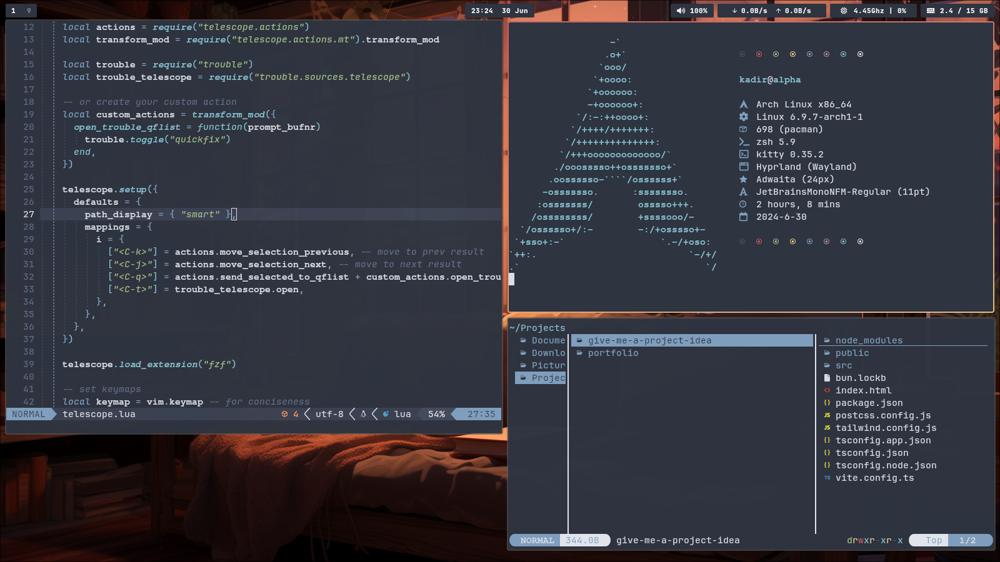

<p align="center">
  
</p>

<div align="center">
  <a href="#preview">Preview</a> | <a href="#installation">Installation</a> | <a href="#theme">Theme</a>
</div>

## Preview



Welcome to my customized Linux environment built around Arch Linux, featuring various tools and configurations tailored to my workflow.

### Distribution
- **Distribution**: [Arch Linux](https://archlinux.org)

### Components
- **Window Manager**: [Hyprland](https://hyprland.org)
- **Shell**: [Zsh](https://www.zsh.org/)
- **Terminal**: [Kitty](https://sw.kovidgoyal.net/kitty/)
- **Bar**: [Waybar](https://github.com/Alexays/Waybar)
- **Notify Daemon**: [Mako](https://github.com/emersion/mako)
- **Dmenu**: [Wofi](https://hg.sr.ht/~scoopta/wofi)
- **Editor**: [Neovim](https://neovim.io/)
- **File Manager**: [Dolphin](https://apps.kde.org/dolphin/)
- **System Information**: [Fastfetch](https://github.com/fastfetch-cli/fastfetch)

## Installation

> [!CAUTION]
> The configurations provided here are highly personalized. Ensure you understand each change before applying them to your system. Use at your own risk!

### Steps to Install

1. **Clone the repository:**
   ```bash
   git clone https://github.com/kadirc001/dotfiles
   ```
2. **Backup your existing dotfiles (if any):**
   ```bash
   mv ~/.config ~/.config.bak
   mv ~/.zshrc ~/.zshrc.bak
   ```
3. **Move the cloned repository to your home directory:**
   ```bash
   mv dotfiles/.config ~/.config
   mv dotfiles/.zshrc ~/.zshrc
   ```
4. **Install required applications:**
    For Arch Linux
   ```bash
   yay -S kitty librewolf-bin zsh waybar mako wofi neovim dolphin vlc fastfetch hyprlock hyprpaper hyprshot btop fzf zoxide zinit starship kvantum nwg-look ttf-jetbrains-mono ttf-jetbrains-mono-nerd pavucontrol
   ```
5. **Restart your computer to apply changes (or logout & login):**
   ```bash
   reboot
   ```

## Theme
- **Theme:** [Nord Theme](https://www.nordtheme.com/)
